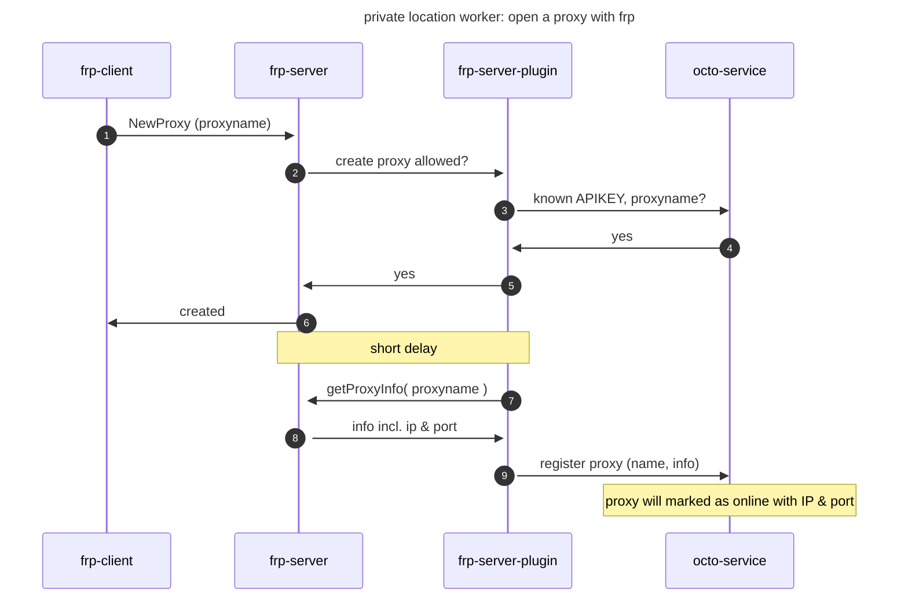
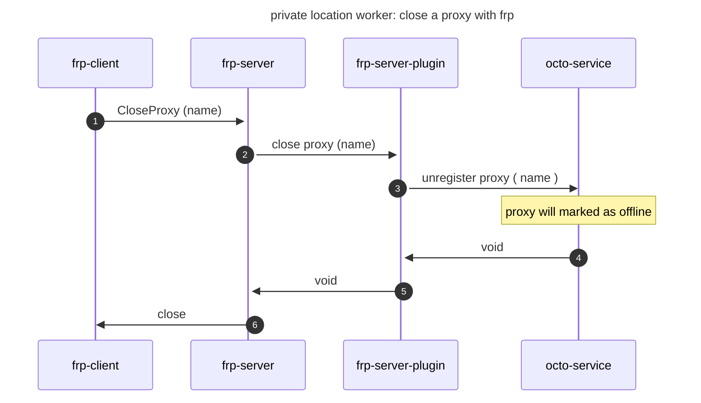

# private location worker

simple local squid proxy (password protected) accessable by a frp tunnel.


# proxy flows

## new proxy / open proxy



## close proxy



# use

customer can run and build the private location worker on their premises using a container.

container image will be provided by octomind see [registry](eu.gcr.io/octomind-dev/plw:latest) or it can be build on your own see [below](#build)

to run the container a few environment variables are needed
## environment vars

- APIKEY: the octomind APIKEY for your organization
- PLW_NAME: name of the private locations worker as registered in the octomind platform (name must match)
- PROXY_USER: username for the (squid) proxy
- PROXY_PASS: password for the (squid) proxy
- SERVER_ADDR: the address of the server that the worker will connect (one of our proxy server addresses 35.192.162.70 or 34.159.153.198)

The PROXY_USER and PROXY_PASS will protect your local proxy from authenticated access. When the worker starts it will register with the octomind platform and set the proxy user and pass, so that the octomind agent and test runner can of course use the proxy.

You can start as many private location worker as you like, but each must be registered by name with octomind first. The name must
be unique for your organization.

NYI: for scaling we will also support multiple instances of worker with the same name, but currently only one instance is supported.

## run

private location worker can simply run as docker container:
```
docker run --rm -e PLW_NAME=worker1 -e APIKEY=12345 -e PROXY_PASS=secret -e PROXY_USER=octo eu.gcr.io/octomind-dev/plw:latest
```

or use docker compose like this.

```yaml
services:
  private-location-worker:
    image: eu.gcr.io/octomind-dev/plw:latest
    environment:
      APIKEY: 1234
      PLW_NAME: worker1
      PROXY_USER: foo
      PROXY_PASS: bar
    restart: on-failure
```

